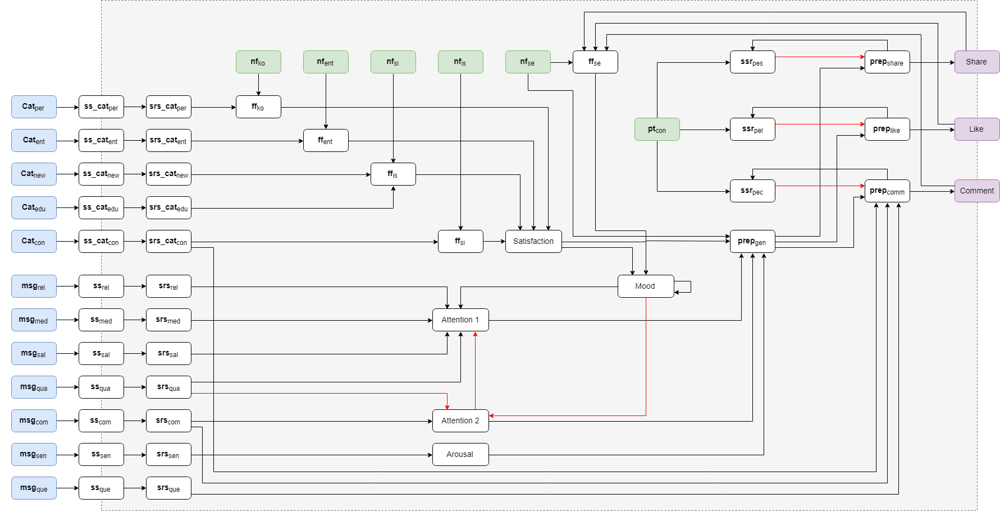

# Cognitive model for sharing behavior

This code is related to the article 'A Computational Cognitive Model for Interaction Behavior on Facebook'.

The code is a simulation of the model provided in the article. If you have questions, please contact *eric at dcc.ufla.br*.



## Scenarios

The scenarios simulated here are of an agent interacting with posts from Facebook. Three different kinds of agents are generated, and the sequence of messages is the same.

### Agents

The agents created are:

1. Agent with high interest in self expression, information sharing and social interaction and low conscientiousness.
2. Agent with high interest in entertainment.
3. Agent with high interest for knowledge and information sharing in all the topics and high conscientiousness.

### Messages

Five different kinds of messages were generated. The agent is exposed for 20 time steps to each of the messages. The 5 kinds of messages are: fake news, news, holiday pictures, online course advert and videos or pictures of cats.

Below is the structure of the posts containing fake news. 

```
"fake_news": {
                    "cat_per": 0,
                    "cat_ent": 0,
                    "cat_new": 1,
                    "cat_edu": 0,
                    "cat_con": 0,

                    "msg_rel": 1,
                    "msg_med": 0.5,
                    "msg_qua": 0.5,
                    "msg_sal": 1,
                    "msg_com": 0,
                    "msg_sen": 1,
                    "msg_que": 0
                }
```

### Message characteristics

The messages received by the agent present the following characteristics:

* **cat_per:** post belongs to category Personal
* **cat_ent:** post belongs to category Entertainment
* **cat_new:** post belongs to category News
* **cat_edu:** post belongs to category Education
* **cat_con:** post belongs to category Conversational
* **msg_rel:** the relation to the source - [0,1]
* **msg_qua:** the overall quality of the post -  [0,1]
* **msg_sen:** the sentiment of a message - [0,1]
* **msg_sal:** the saliency of a post - [0,1]
* **msg_med:** the presence of media in the post - 0, 0.5 or 1
* **msg_com:** the complexity of the message - [0,1]
* **msg_que:** the presence of a question in the post - 0 or 1

## Structure of the code

The project contains two parts: the model and the parameter tuning.

### The model (model.py)

The file model.py contains all the functions to run the model. The code basically contains as inputs the messages received by the agent, its traits and the list of nodes and edges for the model.

As output the information about the reactions are provided by the states share, comment or like. The model is based on Facebook platform interaction by the user.

A function to run a sequence of messages is also provided. In this case, the values for speed factor, steps and step size are inside the function. The traits permit that different agents are simulated within different function calls.

The folder **data** contains the inputs for the model. The file *states.csv* contains the nodes present in the model and the function they use to calculate the next time steps values. The function *id* is based on the previous state connected to the node. The function *alogistic* depends on the values for threshold and steepness. The function can be seen in the article, and is calculated by the function **alogistic**(c, tau, sigma). The values for the parameters are in the *alogistic.json* file. The states that have input as a function are the nodes who are going to receive the values through the function. So they do not need to have a function, as the input is given. When the function is trait, then it means that the state is related to a trait of the agent. The traits are stable values that do not change over time.

The file *connections.csv* contains the connections between the nodes and the weight of them. Nodes with negative weights cause reverse effect in the following node.

#### generate_graph
```python
def generate_graph(weightList=None):
    """
    Inputs: weightList with ((source,target),weight) values
    """
    ...
    return graph, outWeightList
```
Reads the files for the nodes and edges and returns a nx.DiGraph() and a list with the weights for the edges.

#### run_message
```python
def run_message(message=None, traits=None, previous_status_dict=None, 
	alogistic_parameters=None, speed_factor=0.5, delta_t=1, timesteps=30, weightList=None):
    ...
    return graph, outWeightList, set_traits, alogistic_parameters, psd
```
**Inputs:**

* **message:** list with 12 positions containing (in the sequence) the information for ['cat_per', 'cat_ent', 'cat_new', 'cat_edu', 'cat_con', 'msg_rel', 'msg_qua', 'msg_sen', 'msg_sal', 'msg_med', 'msg_com', 'msg_que']
* **traits:** list with 7 positions containing the ['nk_ko', 'nf_ent', 'nf_is', nf_si', 'nf_se', 'pt_cons', 'mood']
* **previous_status_dict:** dictionary with the value for the states on the previous time step.
* **alogistic_parameters:** if None, it is taken from the file 'data/alogistic.json'. Contains a dictionary with the values for steepness and threshold for the nodes with alogistic aggregation functions. It also contains the *speed factor for mood*.
* **speed_factor:** speed factor used for the simulation.
* **delta_t:** time step size used for the simulation.
* **timesteps:** time steps to run the simulation.
* **weightList:** the list with the weights of the edges. Used to generate the new DiGraph.

**Outputs:**

* **graph:** graph with the simulation data.
* **outWeightList:** list of edges generated when creating the graph. 
* **set_traits:** value of the traits for the traits + mood as a dictionary.
* **alogistic_parameters:** dictionary with the values for the threshold and steepness for all the traits.
* **psd:** previous status dictionary. The last status for all the nodes in the DiGraph.

#### run_message_sequence
```python
def run_message_sequence(message_seq=None, traits=None, alogistic_parameters=None, title='0'):
	...
	return inputsDF, parameters
```

**Inputs:**

* **message_seq:** array with messages.
* **traits:** vector with 7 positions with the traits + mood.
* **alogistic_parameters:** dictionary with the values for steepness and threshold for the nodes with advanced logistic aggregation function.
* **title:** title of potential graphics resulting from the operation.

**Outputs:**

* **inputsDF:** simulation data for all the nodes in the DiGraph.
* **parameters:** dictionary with the values for the threshold and steepness for all the traits to be passed to run_message.

### The parameter tuning

In development...


## Running the code

In development...

