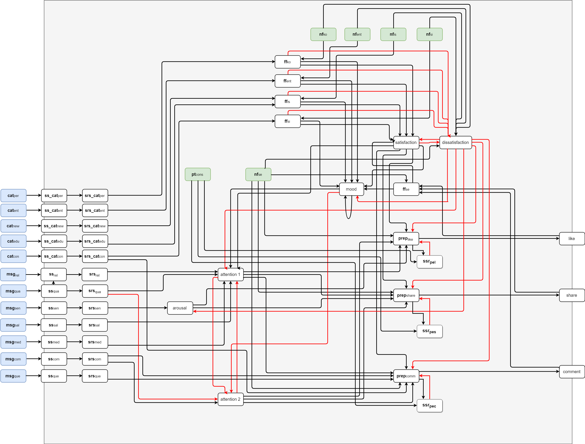

# Cognitive model for sharing behavior

This code is related to the article 'Sharing behavior in web media: a cognitive model proposal'.

The code is a simulation of the model provided in the article. 



## Structure of the code

The project contains two parts: the model and the parameter tuning code.

### The model

The file model.py contains all the functions to run the model. The code basically contains as inputs the messages received by the agent, its traits and the list of nodes and edges for the model.

As output the information about the reactions are provided by the states share, comment or like. The model is based on Facebook platform interaction by the user.

A function to run a sequence of messages is also provided. In this case, the values for speed factor, steps and step size are inside the function. The traits permit that different agents are simulated within different function calls.


### The parameter tuning

This part of the code is found in the file sim_ann.py. It contains the functions to run a simulated annealing algorithm to find the best parameters for the code. In our model we are tuning the parameters for the logistic function and the speed factor for the mood.

## Running the code

To run the model, with the basic test, run the command in the terminal:

```python
python 1_run_model.py
```
